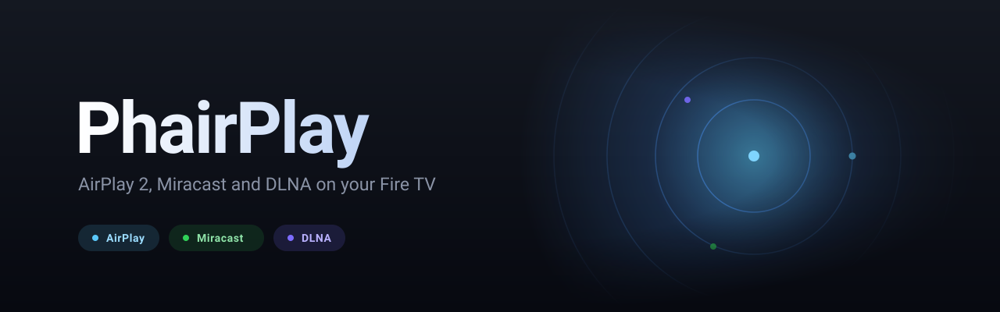
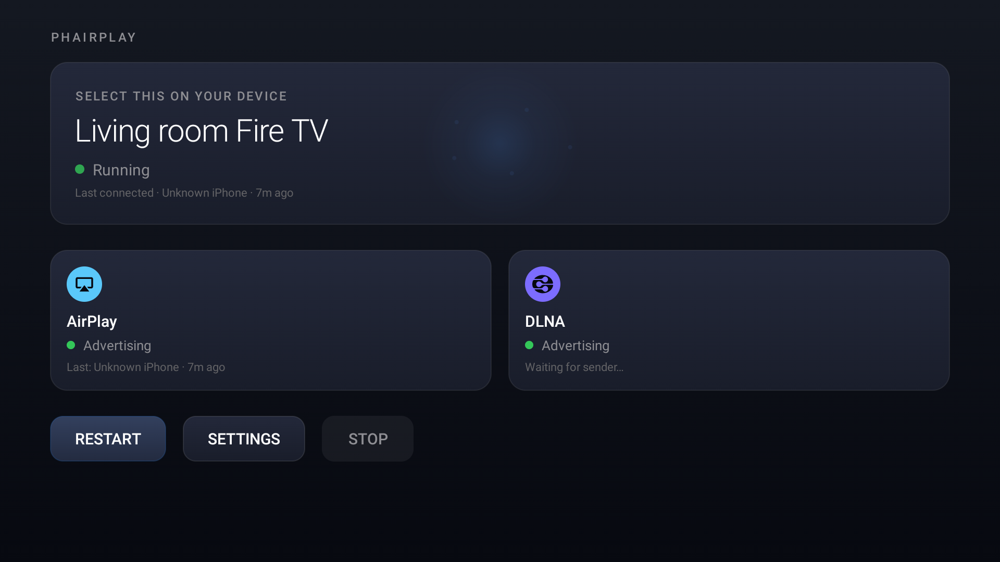

<p align="center">
  
</p>

<p align="center">
  <a href="https://github.com/JObersi10/PhairPlay/releases/latest"></a>
  <a href="https://github.com/JObersi10/PhairPlay/releases"></a>
  
  
  <a href="LICENSE"></a>
</p>

Turn a Fire TV, Android TV or Google TV into an AirPlay 2 receiver. Mirror an iPhone, iPad or Mac to
the television, or send it music and get a full-screen Now Playing display driven by the audio
itself. Free, open source, no ads, no account.

## Features

**Screen mirroring** from iPhone, iPad and macOS, with hardware H.264 decoding.

**AirPlay video** — YouTube, Safari and similar apps hand over the stream itself rather than a
mirror of the screen, so playback runs at full quality without the phone re-encoding anything.

**AirPlay audio**, with a Now Playing screen built around the music: artwork, title, artist, a
progress bar taken from the audio clock rather than wall time, and a backdrop that moves with what
is playing. Projector mode replaces it with three orbs, one each for bass, voice and treble.

**Multi-screen** — more than one sender at once, side by side. How many depends on the device, and
PhairPlay works it out by asking the decoder rather than guessing: throughput is budgeted in pixels
per second and each sender is charged for the resolution it actually negotiated.

**Automatic Bluetooth A/V sync.** A Bluetooth speaker adds roughly 350 ms that Android will not
report, so the picture and the visuals are held back to meet it. Connect a speaker and everything
slides back; disconnect and it snaps forward. There is nothing to tune.

**Control the sender from your TV remote** — play, pause, skip, and hold left or right to scrub.

**DLNA / UPnP MediaRenderer** for VLC, Plex and BubbleUPnP, and **Miracast** for Android and Windows.

**A background service**, so the TV stays discoverable after you leave the app.

Not supported: Google Cast — port 8009 is permanently held by Amazon's own receiver, and the
handshake requires a Google-signed certificate that cannot be obtained. Audio from the macOS Music
app is also unavailable; it uses FairPlay v2, whose key derivation is not publicly known.

## Screenshots

<p align="center">
  
</p>

## Installation

PhairPlay is sideloaded — it is not in the Amazon Appstore.

Download the APK for your device from
[Releases](https://github.com/JObersi10/PhairPlay/releases/latest). There are two builds and they
are **not** interchangeable:

- `PhairPlay-x.y.z-firetv.apk` — Fire TV (Android 7.1 and up)
- `PhairPlay-x.y.z-googletv.apk` — Android TV and Google TV (Android 10 and up)

Install it with Downloader, Send files to TV, or over ADB:

```bash
adb connect <tv-ip>:5555
adb install -r PhairPlay-x.y.z-firetv.apk
```

Then open PhairPlay, and pick the TV from Control Centre → Screen Mirroring on an iPhone or iPad, or
from the AirPlay menu on a Mac.

Some features need permissions the installer cannot grant on your behalf — the remote's focus ring,
turning the display off, and Miracast's location requirement. [docs/PERMISSIONS.md](docs/PERMISSIONS.md)
explains what each one is for and what breaks without it.

## Development

Requires JDK 17 and the Android SDK.

```bash
./gradlew :app:assembleFiretvDebug     # Fire TV
./gradlew :app:assembleGoogletvDebug   # Android TV / Google TV
```

Run everything CI runs before pushing:

```bash
./gradlew :test-runner:test :app:lintFiretvDebug :app:assembleFiretvDebug \
          :app:lintGoogletvDebug :app:assembleGoogletvDebug
```

A running receiver serves a diagnostic dump on port 8001 and a live tail on 8002, which is usually
faster than logcat:

```bash
curl -s http://<tv-ip>:8001/
```

### Documentation

| Document | What it covers |
| --- | --- |
| [ARCHITECTURE.md](docs/ARCHITECTURE.md) | How the receivers, the service and the UI fit together |
| [FEATURES.md](docs/FEATURES.md) | The current feature list in detail |
| [SETTINGS.md](docs/SETTINGS.md) | Every setting, what it does, and when to change it |
| [MULTI_SCREEN.md](docs/MULTI_SCREEN.md) | Multi-sender design, and the decoder limits that bound it |
| [PROJECTOR_MODE.md](docs/PROJECTOR_MODE.md) | The band analysis and orb rendering, as a porting guide |
| [UPDATE_CHECKER.md](docs/UPDATE_CHECKER.md) | In-app updates — read before touching that code |
| [PROTOCOL_RESOURCES.md](docs/PROTOCOL_RESOURCES.md) | External references, and which are known dead ends |
| [PERMISSIONS.md](docs/PERMISSIONS.md) | What each permission is for |
| [TESTING.md](docs/TESTING.md) | Test layout and what is covered |
| [CONTRIBUTING.md](docs/CONTRIBUTING.md) | Conventions and how to submit changes |

## Credits

PhairPlay stands on a lot of protocol reverse-engineering done by other people.

- [PlayFair](https://github.com/EstebanKubata/playfair) by EstebanKubata, obtained via
  [RPiPlay](https://github.com/FD-/RPiPlay) — the FairPlay handshake. GPL-3.0, and the reason this
  project is GPL-3.0.
- [Apple's ALAC decoder](https://github.com/macosforge/alac) — Apache-2.0.
- [RPiPlay](https://github.com/FD-/RPiPlay), [UxPlay](https://github.com/FDH2/UxPlay),
  [shairport-sync](https://github.com/mikebrady/shairport-sync) and
  [pyatv](https://github.com/postlund/pyatv) as protocol references. No code was copied from them.

Full attribution, including runtime dependencies, is in
[THIRD_PARTY_NOTICES.md](THIRD_PARTY_NOTICES.md).

## License

GPL-3.0-or-later. See [LICENSE](LICENSE).

The project bundles PlayFair, which is GPL-3.0, and distributes it compiled into the app — so the
whole work is GPL-3.0. Apache-2.0 is one-way compatible into GPLv3, which is why Apple's ALAC
decoder keeps its own licence headers inside a GPLv3 work.

## Disclaimer

PhairPlay is not affiliated with, endorsed by, or connected to Apple Inc. AirPlay is a trademark of
Apple Inc. This is an independent implementation built from public documentation and open-source
reverse-engineering work, and it neither contains nor requires any Apple software.

It is a receiver only. It does not circumvent DRM, and it cannot play protected content.

## About

Built for a Fire TV Stick sitting under a television, which is a specific and unforgiving target: a
modest decoder, a remote with a D-pad and no pointer, and a viewer three metres away. Most of the
decisions in here follow from that, and the reasoning behind the surprising ones is written down in
`docs/` rather than lost to the commit log.
